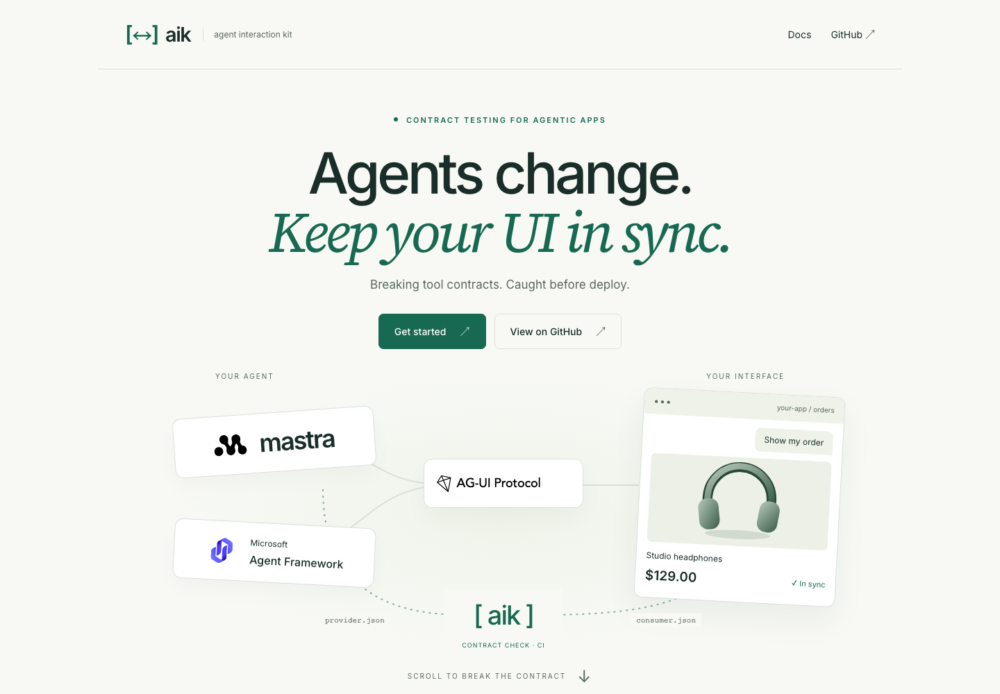
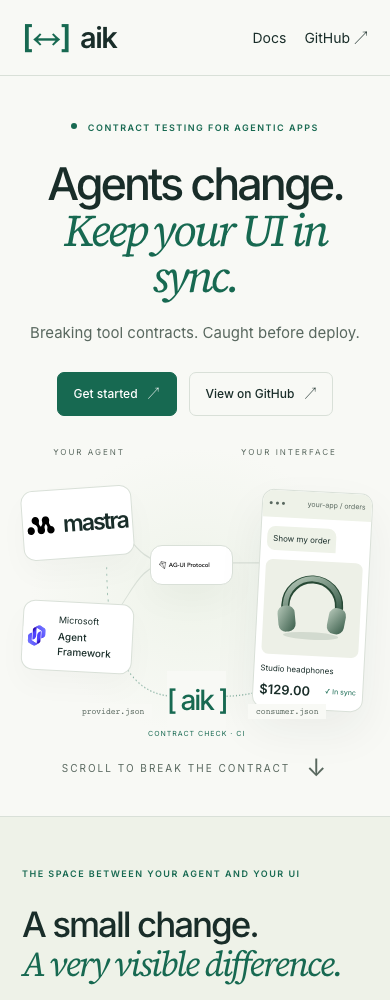

# Editorial landing validation

Implementation branch: `codex/editorial-landing-monorepo`, based on `e0b67f4`.

## Verified locally

- Frozen pnpm installation; core and website production builds.
- 26 core tests, unchanged from the baseline. Core source and tests were moved without content changes.
- TypeScript and Astro checks: no errors, warnings or hints; Biome and Astro/CSS formatting pass.
- Website fixtures evaluated by the actual core: pass, fail (`AIK-RESULT-002`), unknown (`AIK-SCHEMA-001`).
- 11 Playwright tests: widths 360/390/768/1024/1440, all hero artwork loaded, navigation, reversible scroll states, keyboard tabs, clipboard, JSON download endpoint, reduced motion, no-JavaScript content, and WCAG A/AA checks on both routes.
- Additional reflow inspection at 200% CSS zoom and mobile docs: no horizontal page overflow. Container queries adapt the layout to the available content width.
- Core tarball installed outside the monorepo: all four public ESM entrypoints import successfully; CLI exits 0/1/2 for valid/breaking/unknown fixtures with strict mode. No website or fixtures in the tarball.
- The local quickstart command was executed successfully against the valid fixture. `pnpm --filter @agent-interaction-kit/core aik …` invokes the explicit package script, without depending on a self-linked binary.

## Performance measurement

Lighthouse mobile simulation against the local production preview on macOS, 2026-09-07. Local validation runtime Node 26.7.0 / pnpm 10.26.1; GitHub CI uses Node 20 for core and Node 24 for website.

| Measurement | Result |
| --- | --- |
| Performance | 100 |
| Accessibility | 100 |
| LCP | 1.5 s |
| CLS | 0.005 |
| Total blocking time | 0 ms |

These are laboratory results, not field performance guarantees. Hosting/network conditions may change them.

## Captures

## External follow-up

Vercel CLI reports **Logged out**. No Vercel project, preview URL or custom domain was created. Connect the intended Vercel account/project using [the deployment guide](website.md) to enable previews. PRs #7–#11 were not merged; the guide records migration reconciliation points. Merge and production publication remain review steps.
