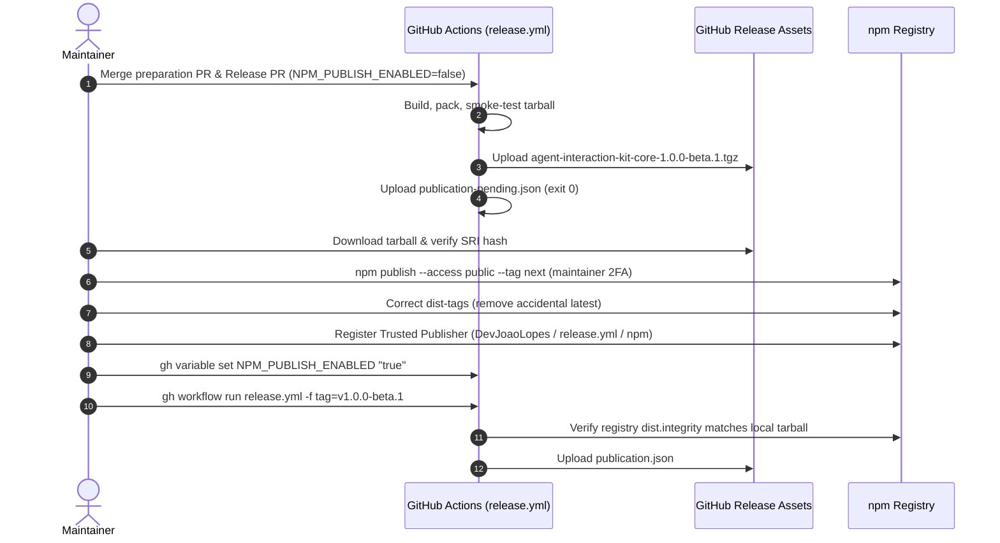

# Release Operations and Recovery Runbook

This document defines the release architecture, observable publication states, maintainer bootstrap procedures, recurring automated releases, stable version promotion, recovery runbooks, and security boundaries for `@agent-interaction-kit/core`.

---

## 1. Release Architecture and Observable States

The release lifecycle of `@agent-interaction-kit/core` coordinates three distributed systems: **GitHub** (source of truth and tag origin), **npm** (package registry and artifact distributor), and **Vercel** (documentation and website hosting).

Because distributed networks do not support atomic multi-system transactions, the release pipeline is organized into three distinct, observable states:

```text
┌─────────────────────────┐     ┌─────────────────────────┐     ┌─────────────────────────┐
│         State 1         │     │         State 2         │     │         State 3         │
│       Tag Created       │ ──► │      npm Published      │ ──► │  Publication Verified   │
│  (Git Tag + GH Release) │     │  (Registry Distribution)│     │  (publication.json)     │
└─────────────────────────┘     └─────────────────────────┘     └─────────────────────────┘
                                                                             │
                                                                             ▼
                                                                ┌─────────────────────────┐
                                                                │  Website Deployment Gate│
                                                                │  (Promote Documentation)│
                                                                └─────────────────────────┘
```

### 1.1 The Three Observable States

| State | Identifier | Observable Artifacts | Verification Command | Description |
| --- | --- | --- | --- | --- |
| **1. Tag Created** | `tag_created` | Git tag `refs/tags/v<VERSION>` + GitHub Release | `gh release view v<VERSION>` | Generated by `release-please` upon merging a release PR to `main`. The code commit is cryptographically fixed, but the package is **not** yet in the registry. |
| **2. npm Published** | `npm_published` | Package version in npm registry under assigned dist-tag channel (`next` or `latest`) | `npm view @agent-interaction-kit/core@<VERSION>` | The inspected, smoke-tested tarball has been uploaded to npm via OIDC Trusted Publishing (or initial maintainer bootstrap). |
| **3. Publication Verified** | `publication_verified` | `publication.json` attached to GitHub Release and Actions artifact | `gh release view v<VERSION> --json assets` | Registry package SRI sha512 integrity confirmed against local build; clean isolated sandbox installation and CLI smoke test passed; signed publication record generated. |

### 1.2 The Publication Gate Constraint

> [!IMPORTANT]
> **A GitHub Release alone does NOT satisfy the website deployment gate.**
> A GitHub Release indicates only that source code was tagged on GitHub. It does not prove that the package was accepted by the npm registry, that registry CDN propagation completed, or that consumers can install the artifact without error.

The website deployment pipeline (`apps/website`) requires a verified `publication.json` record before promoting documentation to production:

```json
{
  "version": "1.0.0-beta.1",
  "channel": "next",
  "tag": "v1.0.0-beta.1",
  "sha": "7fc1d36c6043acb76fbcf0b8818dd3562e2cfe95",
  "integrity": "sha512-...",
  "verifiedAt": "2026-09-13T01:00:00.000Z",
  "workflowRunUrl": "https://github.com/DevJoaoLopes/agent-interaction-kit/actions/runs/12345678"
}
```

This gate guarantees:
1. **Zero Phantom Releases**: The documentation website never advertises or links to a version that consumers cannot actually install via `npm i @agent-interaction-kit/core`.
2. **Race Condition Prevention**: Prevents Vercel production promotions from finishing before npm finishes CDN replication.
3. **Cryptographic Integrity**: Proves that the exact bytes published to npm match the audited build from the tagged Git commit.

---

## 2. Maintainer Bootstrap Guide (First Release: `1.0.0-beta.1`)

npm requires that a package already exists in the registry before configuring **Trusted Publishers (OIDC)**. However, creating an empty placeholder or dummy package is prohibited.

The bootstrap protocol produces the real, fully validated candidate (`1.0.0-beta.1`) in CI, downloads the verified tarball, performs an initial manual publish with maintainer 2FA, configures OIDC, and proves reconciliation.



### Phase 1: Prerequisites and Configuration

1. **Verify merge of preparation PR**:
   Ensure all release infrastructure (scripts, workflows, configuration) is merged into `main`.
2. **Configure GitHub App credentials**:
   Confirm that repository variable `RELEASE_APP_ID` and secret `RELEASE_APP_PRIVATE_KEY` are configured as documented in [accounts.md](./accounts.md).
3. **Confirm publish guard is disabled**:
   Initialize or verify that `NPM_PUBLISH_ENABLED` is set to `"false"`:
   ```bash
   gh variable set NPM_PUBLISH_ENABLED --body "false" --repo DevJoaoLopes/agent-interaction-kit
   ```

### Phase 2: First Release PR Review and Merge

1. The `AIK Release Bot` generates or updates the initial Release PR proposing `1.0.0-beta.1`.
2. **Maintainer Inspection Checklist**:
   - Check PR title: `chore(main): release 1.0.0-beta.1`
   - Check package version in `packages/core/package.json`: `"version": "1.0.0-beta.1"`
   - Check changelog in `packages/core/CHANGELOG.md`: includes all initial features under `## 1.0.0-beta.1`
   - Check manifest in `.release-please-manifest.json`: `"packages/core": "1.0.0-beta.1"`
   - Check version marker in `packages/core/src/index.ts`: `AIK_VERSION = "1.0.0-beta.1"`
3. Click **Squash and merge** (or use `gh pr merge <PR_NUMBER> --squash`).

### Phase 3: Automated Bootstrap Tarball Generation

1. The push to `main` triggers `.github/workflows/release.yml`.
2. The `release` job creates tag `v1.0.0-beta.1` and creates the GitHub Release notes.
3. The `publish` job triggers:
   - Verifies the tag commit is an ancestor of `origin/main`.
   - Checks out the exact tag commit SHA and verifies CI status.
   - Runs full quality gates: `pnpm check`, `pnpm knip`, `pnpm --filter @agent-interaction-kit/core typecheck`, `pnpm test`, `pnpm build:core`.
   - Inspects and packages `@agent-interaction-kit/core` into `dist-package/agent-interaction-kit-core-1.0.0-beta.1.tgz`.
   - Executes local smoke test on the tarball.
   - Computes SRI sha512 integrity hash.
   - Uploads `agent-interaction-kit-core-1.0.0-beta.1.tgz` to the GitHub Release assets.
   - Evaluates `NPM_PUBLISH_ENABLED`: detects `"false"`.
   - Generates `publication-pending.json`, uploads workflow artifact, and exits cleanly (`exit 0`).

### Phase 4: Maintainer Manual Bootstrap Publish

1. **Download the verified tarball from GitHub Release**:
   ```bash
   gh release download v1.0.0-beta.1 \
     -p "agent-interaction-kit-core-1.0.0-beta.1.tgz" \
     --repo DevJoaoLopes/agent-interaction-kit
   ```
2. **Verify tarball integrity**:
   Compute the SRI sha512 hash and verify it matches `publication-pending.json`:
   ```bash
   node scripts/release/publish-decision.mjs sri-hash agent-interaction-kit-core-1.0.0-beta.1.tgz
   ```
3. **Authenticate maintainer session with npm**:
   ```bash
   npm login --registry=https://registry.npmjs.org
   npm whoami --registry=https://registry.npmjs.org
   # Confirm output is DevJoaoLopes
   ```
4. **Publish package to npm under `next` channel**:
   ```bash
   npm publish agent-interaction-kit-core-1.0.0-beta.1.tgz --access public --tag next
   ```

5. **Inspect and correct dist-tags**:
   > [!WARNING]
   > **npm default dist-tag behavior on initial publish**:
   > When a brand new package is published for the first time, npm automatically assigns the `latest` dist-tag in addition to or in place of the specified tag! Because `1.0.0-beta.1` is a prerelease, `latest` must NOT point to it.

   Check the active dist-tags:
   ```bash
   npm dist-tag ls @agent-interaction-kit/core
   ```
   If `latest: 1.0.0-beta.1` is present, immediately remove or fix it:
   ```bash
   npm dist-tag rm @agent-interaction-kit/core latest
   ```
   Confirm that only `next` remains:
   ```bash
   npm dist-tag ls @agent-interaction-kit/core
   # Expected output:
   # next: 1.0.0-beta.1
   ```

> [!NOTE]
> **Provenance Transparency**:
> The initial bootstrap version (`1.0.0-beta.1`) published via local maintainer session will not contain GitHub Actions OIDC provenance signatures. This is documented and accepted for package inception on npmjs.com. All subsequent versions published by CI carry full cryptographic provenance.

### Phase 5: Register Trusted Publisher (OIDC) on npm

1. Open [`https://www.npmjs.com/package/@agent-interaction-kit/core/access`](https://www.npmjs.com/package/@agent-interaction-kit/core/access) in your browser.
2. Under **Publishing Access** / **Trusted Publishers**, click **Add a new GitHub Actions publisher**.
3. Configure the exact publisher fields:
   - **GitHub organization or user**: `DevJoaoLopes`
   - **Repository name**: `agent-interaction-kit`
   - **Workflow filename**: `release.yml`
   - **Environment name**: `npm`
4. Click **Add publisher**.
5. Confirm that GitHub Actions publisher is listed and active.

### Phase 6: Enable Automated Publishing & Test Reconciliation

1. **Enable automated publishing in GitHub**:
   ```bash
   gh variable set NPM_PUBLISH_ENABLED --body "true" --repo DevJoaoLopes/agent-interaction-kit
   ```

2. **Trigger reconciliation rerun on `main` for the bootstrap tag**:
   ```bash
   gh workflow run release.yml --ref main -f tag=v1.0.0-beta.1
   ```

3. **Verify reconciliation behavior**:
   - The workflow runs on `main` for tag `v1.0.0-beta.1`.
   - Checks out the exact tag commit and verifies quality gates.
   - Builds tarball and computes local SRI sha512 integrity.
   - Queries registry: `npm view @agent-interaction-kit/core@1.0.0-beta.1 --json`.
   - Detects package already exists in registry.
   - Compares registry `dist.integrity` with local SRI integrity: **matches**.
   - Installs `@agent-interaction-kit/core@1.0.0-beta.1` from registry in an isolated environment and executes smoke test.
   - Generates `publication.json` and uploads it to GitHub Release `v1.0.0-beta.1`.

### Phase 7: Prove Recurring OIDC Automation with `1.0.0-beta.2`

To prove the automated OIDC publishing flow without publishing dummy code:
1. Implement a genuine improvement or bugfix identified during validation.
2. Commit with Conventional Commits (e.g., `fix(core): ...` or `feat(core): ...`).
3. Release bot opens Release PR proposing `1.0.0-beta.2`.
4. Maintainer reviews and squash-merges PR.
5. `release.yml` executes autonomously:
   - Detects absent version in registry (`404 Not Found`).
   - Publishes directly to npm with `--access public --tag next` via OIDC (`id-token: write`).
   - Verifies publication and produces `publication.json`.

---

## 3. Recurring Automated Release Lifecycle

After bootstrap, all releases operate automatically under maintainer supervision:

```text
Developer / Maintainer
       │
       ▼  Merge Conventional Commit to main (feat, fix, perf)
GitHub Actions (CI)
       │
       ▼  Checks pass on main
Release Bot (AIK Release Bot)
       │
       ▼  Opens / updates Release PR (release-please)
Maintainer
       │
       ▼  Reviews diff & squash-merges Release PR
Release Workflow (release.yml)
       │
       ├─► Creates Git tag (v<VERSION>) & GitHub Release
       ├─► Validates tag ancestry and commit status
       ├─► Builds, packs, and smokes package tarball
       ├─► Publishes to npm via OIDC Trusted Publishing (channel: next or latest)
       ├─► Installs from npm registry & executes smoke test
       └─► Generates and attaches publication.json to GitHub Release
               │
               ▼
Website Deployment Gate
       └─► Promotes documentation to production
```

### Channel Routing Rules

The release pipeline automatically routes package channels based on version format:

| Version Pattern | Release Type | npm Channel / Dist-tag | GitHub Release Flag |
| --- | --- | --- | --- |
| `1.0.0-beta.X` | Prerelease | `next` | `prerelease: true` |
| `1.0.0` (and later stable) | Stable | `latest` | `prerelease: false` |

---

## 4. Stable Promotion Runbook (`1.0.0`)

Promotion from beta to stable `1.0.0` occurs **only** after comprehensive end-to-end and runtime validation with Agamenon.

> [!CAUTION]
> **Never promote automatically upon test suite completion.**
> Stable promotion requires deliberate maintainer action: reconfiguring release-please versioning strategy, adding a promotion commit, reviewing the generated Release PR, and approving the squash merge.

### Step-by-Step Promotion Procedure

#### Step 1: Update `release-please-config.json`
Edit `release-please-config.json` to transition `packages/core` from prerelease mode to default SemVer versioning:

```json
{
  "$schema": "https://raw.githubusercontent.com/googleapis/release-please/main/schemas/config.json",
  "packages": {
    "packages/core": {
      "release-type": "node",
      "package-name": "@agent-interaction-kit/core",
      "include-component-in-tag": false,
      "include-v-in-tag": true,
      "versioning": "default",
      "prerelease": false,
      "extra-files": [
        {
          "type": "generic",
          "path": "src/index.ts"
        }
      ]
    }
  }
}
```

#### Step 2: Author Promotion Commit with `Release-As: 1.0.0`
Create a commit affecting `packages/core` that includes the `Release-As: 1.0.0` footer:

```bash
git checkout -b chore/promote-stable-1.0.0
# Make relevant commit or stage release configuration changes
git commit -m "feat(core): stabilize api contracts for 1.0.0 release

Validates schema drift checks against Agamenon end-to-end integration.

Release-As: 1.0.0"
git push origin chore/promote-stable-1.0.0
```

Open a PR, wait for CI to pass, and squash-merge to `main`.

#### Step 3: Bot Prepares Stable Release PR
1. On push to `main`, `release.yml` triggers `release-please`.
2. The bot parses `Release-As: 1.0.0` and creates a Release PR titled:
   `chore(main): release 1.0.0`
3. The PR bumps `packages/core/package.json` to `1.0.0` and finalizes `CHANGELOG.md`.

#### Step 4: Maintainer Review and Merge
Maintainer reviews the PR and squash-merges into `main`.

#### Step 5: Automated Stable Publication
1. `release.yml` triggers on `main`.
2. Tag `v1.0.0` is created.
3. Policy router identifies `1.0.0` as stable (`isPrerelease: false`) and selects dist-tag `latest`.
4. Publishes to npm registry: `npm publish ... --access public --tag latest`.
5. Verifies registry availability and runs clean smoke test on `@agent-interaction-kit/core@1.0.0`.
6. Generates `publication.json` with `"channel": "latest"` and attaches it to GitHub Release `v1.0.0`.

#### Step 6: Verify Dist-Tags
Confirm dist-tags in npm registry:
```bash
npm dist-tag ls @agent-interaction-kit/core
# Expected output:
# latest: 1.0.0
# next: 1.0.0-beta.X
```

---

## 5. Recovery and Emergency Runbooks

### Runbook A: Resuming an Interrupted or Failed Release

If a release workflow fails (e.g. temporary network partition, npm registry latency, runner cancellation) after the tag and GitHub Release were already created:

#### Execution Command:
```bash
gh workflow run release.yml --ref main -f tag=v<VERSION>
```

#### Pre-conditions Enforced by Workflow:
1. **Ref Currency**: Must be dispatched against `refs/heads/main` (`--ref main`).
2. **Tag Existence**: The tag `v<VERSION>` must already exist and have an associated GitHub Release.
3. **Commit Ancestry**: The tag commit SHA must be an ancestor of `origin/main` (`git merge-base --is-ancestor <tag_sha> origin/main`). Out-of-tree or branch tags are rejected before build.
4. **Integrity Guard**:
   - If the version is **not** on npm: builds tarball, verifies quality gates, and publishes via OIDC.
   - If the version is **already** on npm: computes local SRI sha512 hash and compares it against registry `dist.integrity`. If hashes do not match, the workflow aborts with an error (preventing tampering or divergent builds).
5. **Publication Record**: Smoke tests registry package and generates `publication.json`.

---

### Runbook B: Retrying Older Versions Without Dist-Tag Regression

If a maintainer reruns the release workflow for an older release tag (e.g. `v1.0.0-beta.1`) when a newer release (e.g. `1.0.0-beta.2` or `1.0.0`) is already the active channel head on npm:

```bash
gh workflow run release.yml --ref main -f tag=v1.0.0-beta.1
```

#### Built-in Channel Head Safety:
The workflow compares the requested version against the active dist-tag head (`npm view @agent-interaction-kit/core dist-tags.<channel>`):
- **Integrity Verified**: Confirms registry integrity matches the tagged commit.
- **Tag Invariance**: Does **NOT** downgrade the channel dist-tag on npm (e.g., `next` remains pointed to `1.0.0-beta.2`).
- **Deploy Guard**: Does **NOT** trigger automated downstream website deployments for older releases.
- **Audit Logging**: Emits an informational notice in workflow step summary.

---

### Runbook C: Defective Version Policy (Immutable Tags)

> [!WARNING]
> **Golden Rules of Release Immutability**:
> 1. **NEVER delete a published Git tag**: Tags matching `refs/tags/v*` are locked by GitHub Ruleset `release-tags-protection` (ID: `23119843`). Deleting tags breaks cryptographic provenance and audit histories.
> 2. **NEVER move an existing Git tag**: Moving tags causes checksum discrepancies and breaks package verification.
> 3. **NEVER attempt to overwrite an existing npm version**: npm forbids re-publishing an existing version (`403 Forbidden / EPUBLISHCONFLICT`).

#### Remediation Procedure for Defective Releases:

1. **Deprecate the defective version on npm**:
   Provide a clear reason and remediation instructions:
   ```bash
   npm deprecate @agent-interaction-kit/core@<DEFECTIVE_VERSION> "Critical bug in <FEATURE>; upgrade to <CORRECTED_VERSION>"
   ```

2. **Develop the fix**:
   Create a fix branch from `main`, implement the fix, and add regression tests.

3. **Submit and merge fix PR**:
   Open a pull request with Conventional Commit prefix (`fix(core): ...`). Merge to `main` via squash merge.

4. **Release corrected version**:
   The release bot automatically proposes the next version bump (e.g. `1.0.0-beta.3` or `1.0.1`). Review and merge the Release PR to distribute the fix.

---

### Runbook D: Emergency Registry and Integrity Diagnostics

Use the following commands to inspect package state and troubleshoot registry issues:

```bash
# 1. View all active dist-tags
npm dist-tag ls @agent-interaction-kit/core

# 2. View all published versions and release timestamps
npm view @agent-interaction-kit/core versions time --json

# 3. View exact distribution metadata and SRI integrity
npm view @agent-interaction-kit/core@<VERSION> dist --json

# 4. View provenance attestation (if published via OIDC)
npm view @agent-interaction-kit/core@<VERSION> dist.attestations --json

# 5. Compute SRI sha512 hash of any local tarball
node scripts/release/publish-decision.mjs sri-hash <path-to-tarball>

# 6. Verify release tag against repository policy locally
node scripts/release/verify-release.mjs <tag>
```

---

## 6. Security and Zero-Secrets Compliance

The release pipeline complies with the project's zero-secrets policy:

| Asset / Credential | Storage Location | Lifetime | Purpose |
| --- | --- | --- | --- |
| **npm Publishing Auth** | OIDC Identity Token (`id-token: write`) | Ephemeral (job duration) | Direct cryptographic exchange with `registry.npmjs.org`. **No `NPM_TOKEN` exists or is permitted**. |
| **GitHub App ID** | Repository Variable (`RELEASE_APP_ID`) | Permanent | Public identifier of `AIK Release Bot`. |
| **GitHub App Private Key** | Repository Secret (`RELEASE_APP_PRIVATE_KEY`) | Permanent | Generates short-lived installation tokens (1 hour) for `release-please`. Never exposed in PR workflows. |
| **Environment Boundary** | `environment: npm` | Bound to `main` | Restricts publish permissions and OIDC tokens to protected branch executions only. |
| **Tarball Sanitization** | `scripts/release/pack-inspect.mjs` | Pre-pack gate | Scans every package tarball before publish, rejecting `.env`, `.pem`, test fixtures, sources, or sensitive files. |
| **Shell Injection Guard** | `process.env` passing | Build step gate | All parameters, version strings, and tag inputs are passed through environment variables, preventing command injection. |

For detailed credential inventory and account governance, see [accounts.md](./accounts.md) and [governance.md](./governance.md).
